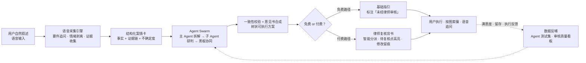
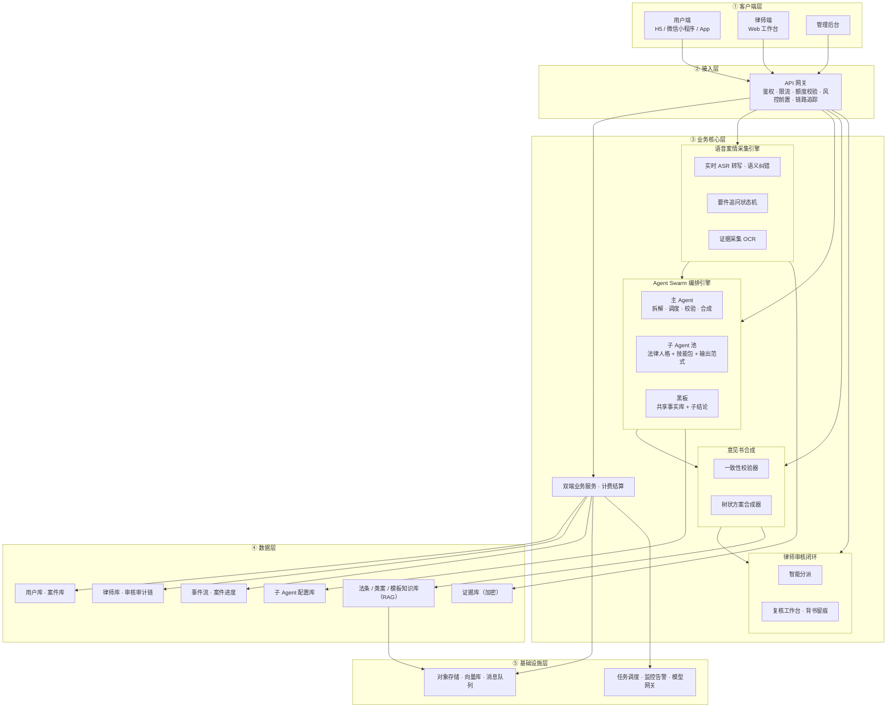
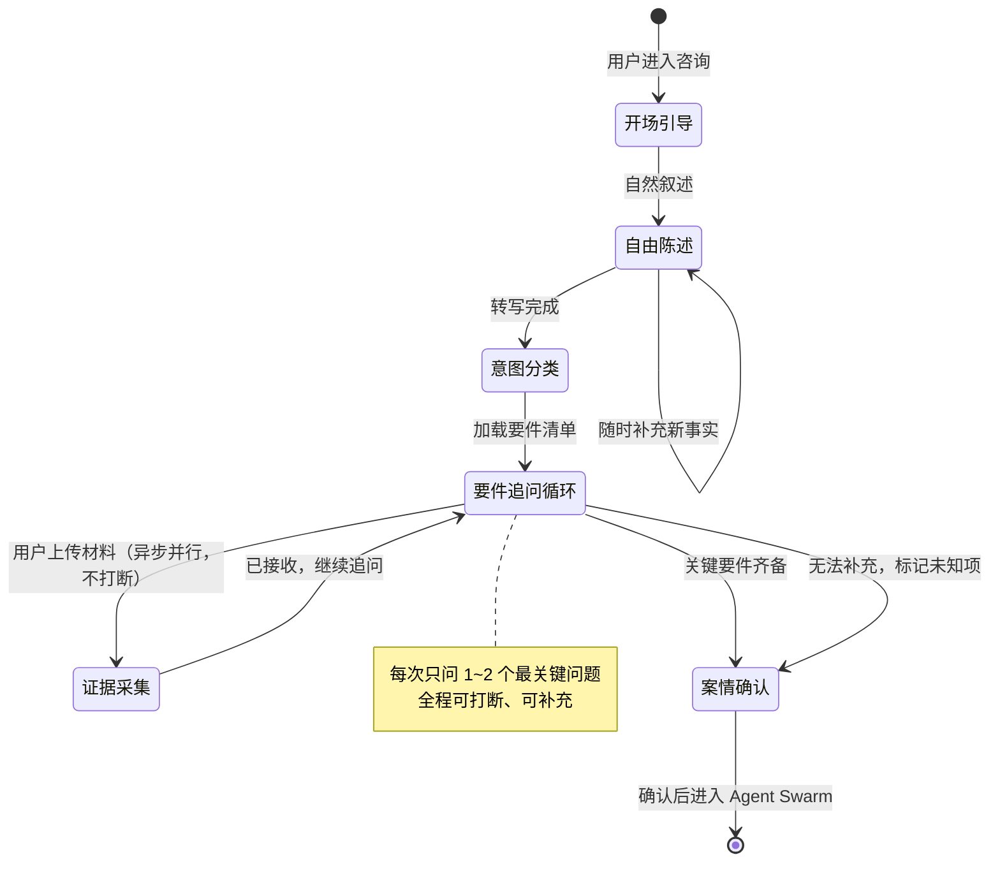
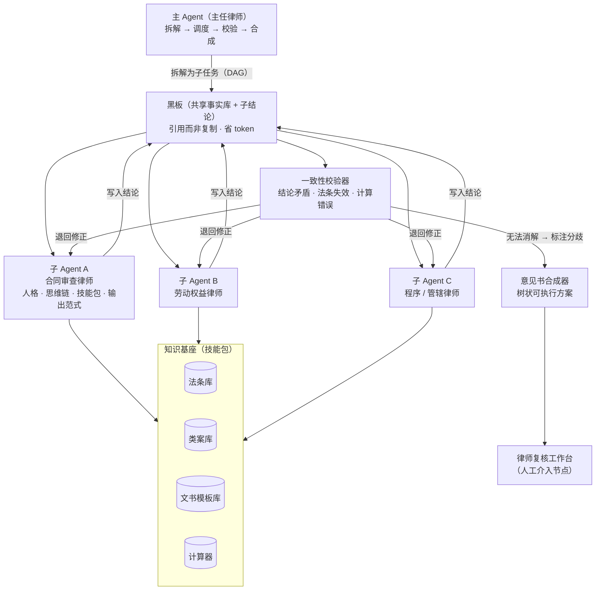
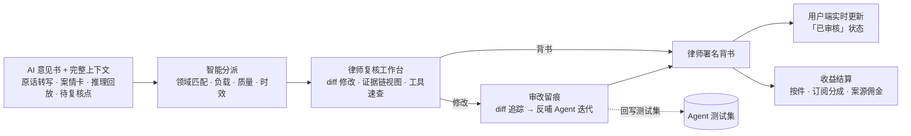
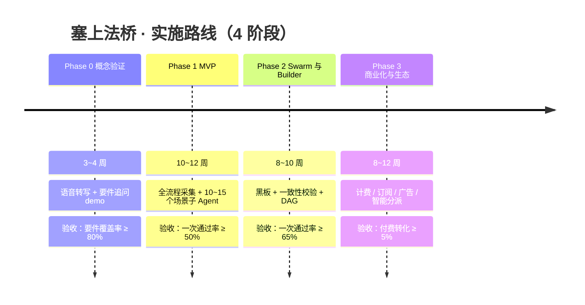

# 塞上法桥 · 可行技术方案（v1.0）

> **文档用途**：面向开发团队的技术实施方案；面向设计团队的"需求 → 技术"映射说明。
> **一句话定位**：面向非专业人士的"AI 法律助手 + 持证律师审核背书"平台——用语音把普通人复杂的法律纠纷讲清楚，用 Agent Swarm 像律师一样思考，用树状方案让他们照着做，用职业律师复核兜底。
> **核心闭环**：语音采集案情 → 案情结构化 → Agent Swarm 研判 → 律师复核背书 → 树状可执行方案 → 用户执行与追问 → 数据反哺 Agent 迭代。



> 💡 以下所有架构图均为 Mermaid 图，可在 GitHub / Typora / VS Code 中直接渲染；也可<a href="架构图集.html" target="_blank">打开浏览器版架构图集</a>（新标签页，可逐张导出 PNG / SVG）。

---

## 目录

1. [总体架构与技术选型](#1-总体架构与技术选型)
2. [核心引擎一：语音案情采集（"前台实习律师"）](#2-核心引擎一语音案情采集前台实习律师)
3. [核心引擎二：Agent Swarm（"虚拟律所办公室"）](#3-核心引擎二agent-swarm虚拟律所办公室)
4. [最终生成物：树状可执行方案](#4-最终生成物树状可执行方案)
5. [律师侧：入驻、审核与背书闭环](#5-律师侧入驻审核与背书闭环)
6. [后台系统：监控、数据、安全、评价](#6-后台系统监控数据安全评价)
7. [商业模式的技术支撑](#7-商业模式的技术支撑)
8. [外部集成与本地文件处理](#8-外部集成与本地文件处理)
9. [UI / 虚拟律所视觉的技术实现](#9-ui--虚拟律所视觉的技术实现)
10. [实施路线与里程碑](#10-实施路线与里程碑)
11. [风险清单与对策](#11-风险清单与对策)
12. [团队分工与设计团队产出物清单](#12-团队分工与设计团队产出物清单)
- [附录 A：子 Agent 目录规划（首批 30 个示例）](#附录-a子-agent-目录规划首批-30-个示例)
- [附录 B：MVP 与二期功能切分](#附录-bmvp-与二期功能切分)

---

## 1. 总体架构与技术选型

### 1.1 分层架构



### 1.2 技术选型建议（国产可落地，供开发团队最终拍板）

| 模块 | 建议方案 | 理由 / 备注 |
|---|---|---|
| 大模型 | 多模型路由：DeepSeek-V3/R1、通义千问、GLM、Kimi/Moonshot（火山方舟 / 阿里云 / 智谱 API） | 法律长文本推理 + 便宜；不绑死单一厂商，按任务选模型（拆解用推理强模型，摘要用便宜模型） |
| 语音 ASR | 火山引擎 / 讯飞 / 阿里云实时流式 ASR（WebSocket） | 中文识别率第一梯队；支持热词表与实时转写 |
| 语音 TTS | 火山 / 讯飞多音色 | 方案播报、"律师讲解"音色 |
| Agent 编排 | MVP 用 LangGraph（状态机 + 人工介入节点天然适配律师审核）；规模化后自研编排器 | LangGraph 可暂停等待律师复核，且便于回放"推理全过程"给律师看 |
| 后端 | Python FastAPI（AI 链路）+ Go（网关/计费/高并发） | 团队熟悉度优先，二选一也可 |
| 前端 | React/Vue + 微信小程序；动画用 PixiJS / Lottie | 像素风 + 动画资产 |
| 数据库 | PostgreSQL + pgvector（向量检索）、Redis（会话/缓存） | 关系数据 + RAG 一套搞定 |
| 存储 | MinIO / 阿里云 OSS | 证据、文书、媒体 |
| 队列/任务 | RabbitMQ / Kafka | 子 Agent 异步任务、审核任务流 |
| 检索 | 混合检索：BM25 + 向量 + 条文编号精确引用 | 法律引用必须"见条文原文"，防幻觉 |
| 可观测 | OpenTelemetry 全链路 trace（案件维度成本归集） | 后台监控核心 |
| 部署 | Docker + K8s，Dify/Coze 可先做原型验证 | 快速起步 |

### 1.3 两条主线的技术落点

| 你的核心问题 | 技术落点 | 优先级 |
|---|---|---|
| ① AI 答案的专业性与实用性（最重要） | 语音案情采集（要件驱动追问）+ Agent Swarm（领域专精子 Agent + 黑板协同）+ 知识库引用强制 + 测试集回归 | P0 |
| ② 高效透明、权责分明的审核机制 | 全流程可回放（AI 推理过程随案交付律师）+ 不确定度标注 + 智能分派 + 审核留痕背书 | P0 |
| ③ 简洁语音交互 | 实时 ASR + 语义纠错 + 要件卡片驱动的追问状态机 | P1 |
| ④ 可玩性 UI | 像素风 + 事件流驱动的案件进度可视化 | P1 |

---

## 2. 核心引擎一：语音案情采集（"前台实习律师"）

### 2.1 交互流程（状态机）



1. **开场引导**：一句话说明"您可以像和律师聊天一样把事情经过说出来，我会追问您几个关键问题，过程中您可以随时上传材料（照片/截图），不用打断说话"。
2. **自由陈述**：实时流式 ASR 转写，用户说到哪算哪。
3. **意图分类**：LLM 将陈述归类为纠纷类型（多标签，如"租房合同 + 押金返还"），加载对应**要件事实清单**。
4. **要件追问循环**：对照清单找缺口，**每次只问 1~2 个最关键的问题**（避免审问感），直到关键要件齐备；用户答不上的标为"未知/待补充"，记录不确定度。
5. **证据采集（异步并行）**：用户拍照/上传截图即后台处理，**不打断语音**；处理完语音提示"已收到您的合同照片，正在提取关键信息"。
6. **案情确认**：以"案情小结卡"复述（您刚说的情况是这样，对吗？），用户确认后进入 Agent Swarm。

### 2.2 追问为什么准：要件事实清单库

- 追问不是 AI 自由发挥，而是**按纠纷类型预置的要件卡片**驱动。例：租房押金纠纷卡片包含——租赁合同是否签订/形式、押金支付方式与金额、退租交接情况、房东扣款理由、有无书面沟通记录、房屋损害事实、管辖地。
- 每个卡片对应一个 **JSON Schema**（案情卡），采集过程 = 填卡过程。Schema 由设计团队与法务顾问共同定义，是"像律师一样思考"的第一步落地。
- **律师式告知**：当用户遗漏关键事实时，AI 明确提示"这个信息对您的案件定性很重要，因为…"，解释而非审问。

### 2.3 语音转写质量保障

| 问题 | 对策 |
|---|---|
| 同音词错误（定金/订金、违约金、管辖） | 场景化 ASR 热词表 + LLM 结合上下文的语义纠错 |
| 方言/口音 | 优先选方言兼容性好的引擎；纠错层兜底 |
| 多人/环境噪音 | 引导"请到安静处"，VAD 断句，关键数字二次确认（金额/日期/账号复述确认） |
| 情绪化表述 | LLM 剥离情绪，重写为客观事实流，保留主体、时间、金额、行为四要素 |

### 2.4 证据采集

- 入口：拍照、相册、聊天记录截图、本地文件（PDF/Word，见第 8 节本地解析）。
- 流水线：压缩 → OCR → **证据类型分类**（合同/聊天记录/转账凭证/通知文书）→ **关键字段抽取**（金额、日期、主体、签署）→ 回填案情卡 → 哈希存证（防篡改，审核律师可查看原始件）。
- 隐私：证据默认加密存储、最小权限访问；用户可随时删除，删除后物理清除副本。

### 2.5 语音指令层（"平台级语音操作系统"）

用户可用自然语言直接调度平台能力（相当于你说的"类似 GPT 新语言模型的功能"——**不需要自研大模型，本质是一个意图路由层**）：

- 功能指令："打开我的案件""查看方案第二步""这个我不懂，再讲一遍" → 路由到对应模块。
- Agent 召唤："叫合同审查律师帮我看一眼" → 直接调度对应子 Agent。
- 实现：NLU 意图识别（LLM 分类 + 槽位提取）→ 平台命令树；意图置信度低时回退到对话确认。

---

## 3. 核心引擎二：Agent Swarm（"虚拟律所办公室"）

### 3.1 整体编排架构



### 3.2 主 Agent 的四个职责（动态编排）

1. **拆解**：把案情卡拆成若干独立子任务（DAG），每个子任务指定：目标、调用哪个子 Agent、只读哪段案情切片、依赖哪些子任务。
   - 例："劳动纠纷 + 辞退赔偿"拆为：①劳动关系认定 ②违法辞退认定 ③补偿金计算 ④证据清单 ⑤程序路径（仲裁/时效）。
2. **调度**：按 DAG 并行执行；复杂度高时自动加派子 Agent（动态编排），简单案件少派（省 token）。
3. **校验**：收集子 Agent 结论，一致性校验器检查冲突（见 3.4）。
4. **合成**：输出树状方案（见第 4 节）。

### 3.3 子 Agent：如何把律师经验变成可运行的"法律人格"

每个子 Agent 由 **Agent Builder 配置库**定义，配置即代码（YAML/JSON），可热更新、可新增，不改代码即可上架新 Agent。核心四件套：

```
subagent.yaml
├── ① 法律人格（角色卡）：名称/像素形象/专业领域/执业风格/职权边界
│     （边界示例：房产律师发现涉刑线索 → 必须转介并告知用户）
├── ② 思维链模板（办案SOP）：事实梳理→争点归纳→法律检索→要件分析→结论
├── ③ 技能包（MCP工具 + Skill）：
│     · 法条检索（条文编号精确引用，输出必带原文）
│     · 类案检索（公开裁判文书库）
│     · 计算器（经济补偿金N/N+1/2N、利息、诉讼费、时效截止日）
│     · 文书生成（起诉状/仲裁申请/证据清单/律师函模板）
│     · 流程知识（去哪办、带什么、多少天：立案/仲裁/12348）
├── ④ 输出范式（JSON Schema，强制）：
│     {结论, 事实认定, 法律依据[], 行动步骤[], 风险, 不确定度, 待律师复核点}
└── ⑤ 示例库（few-shot）：20~50 个真实历史案例回放
```

**经验萃取方法**（设计团队主责，与法务顾问共建）：
资深律师访谈 → 流程复盘（"您接到这类案子先看什么、再看什么"）→ 转写为标准化 SOP 与要件清单 → 用历史真实案例做成**测试集** → 子 Agent 跑测试集看通过率/幻觉率/要件覆盖率 → 迭代 → 上线后持续用真实案件回归。

**token 优化（你的"传回内容共享"设想）**：
- 子 Agent 只读案情卡的**相关切片**而非全文；
- 子任务结果先写入**黑板**，后续子 Agent 直接引用黑板中的结论与引用（引用而非复制全文）；
- 法条/类案检索结果按条文 ID 缓存，全局复用；
- 每个案件设 token 预算，主 Agent 按预算取舍子任务规模。

### 3.4 一致性校验器

| 冲突类型 | 示例 | 处置策略 |
|---|---|---|
| 结论矛盾 | A 说可主张 2N，B 说仅 N | 退回相关子 Agent 带证据重算；仍冲突 → 主 Agent 裁决 |
| 法条引用冲突 | 引用已被废止的司法解释 | 规则层自动拦截（条文有效性库）+ LLM 复核 |
| 事实引用错误 | 子 Agent 张冠李戴金额 | 回查案情卡切片校验 |
| 计算错误 | 补偿金基数算错 | 计算器工具结果为主，LLM 不得覆写计算结果 |

无法消解的**分歧必须保留标注**，作为"待律师复核点"高亮交付给审核律师——这恰好是建立律师信任的关键：AI 不假装确定。

### 3.5 子 Agent 目录规划（上百个的规划策略）

不要一上来堆上百个 Agent。按三层结构规划、分批上线：

- **领域 Agent（10~15 个）**：合同、劳动、侵权、家事、消费、房产、债权债务、公司、行政、刑事常识、程序（仲裁/诉讼/时效）。
- **场景 Agent（首批 20~30 个，可扩到上百）**：租房纠纷、二手房买卖、违法辞退、欠薪、民间借贷、定金/订金、违约赔偿、继承、赠与、网购维权、装修纠纷、交通事故、校园侵权……
- **工具 Agent（5~8 个）**：法条检索、类案检索、赔偿计算、文书生成、证据清单、时效计算、流程指引。

详见 [附录 A](#附录-a子-agent-目录规划首批-30-个示例)。用户自建 Agent（见 3.6）走同一套配置结构，天然可加入公共技能库。

### 3.6 用户自建子 Agent（个性化工具箱 + 技能市场）

- 低代码配置：选领域 → 填人格描述 → 选技能包 → 预览测试（沙箱运行，限制工具权限）。
- 授权机制：自建 Agent 经平台审核（内容安全 + 法律底线）后可上架公共技能库，供其他用户调用；原创者可获得分成/积分，形成 UGC 生态。
- 技术要点：用户 Agent 与平台 Agent 同构（同一配置引擎），只是权限与审核级别不同；沙箱化隔离，禁止访问敏感工具（如证据库全局检索）。

### 3.7 可靠性设计

- 子 Agent 失败/超时 → 降级：主 Agent 直接研判该子任务并标注"未经专精 Agent 处理，已转律师复核"。
- 输出 Schema 强制校验，不符合则重试一次，仍失败则降级。
- 模型路由：复杂拆解用强推理模型，子任务按成本预算选模型，失败自动升级模型重试。

---

## 4. 最终生成物：树状可执行方案

### 4.1 输出结构（树状 JSON，用户端渲染为可折叠卡片树）

```json
{
  "案件编号": "2025-0716-0038",
  "问题诊断": "租房押金返还纠纷：合同约定不明 + 房东扣款理由缺乏证据",
  "结论概要": "三句话讲清：有权主张 / 依据哪几条 / 风险点是什么",
  "行动方案": {
    "第一步": {"动作": "书面催告（模板附上）", "证据": "需准备押金转账记录", "依据": "民法典第563条", "时限": "3日内", "风险": "口头沟通难留证", "备选": "微信文字重发一遍"},
    "第二步": {"动作": "申请调解/拨打12348", "证据": "...", "依据": "...", "时限": "7日内", "风险": "...", "备选": "..."},
    "第三步": {"动作": "小额诉讼/仲裁立案", "证据": "...", "依据": "...", "时限": "...", "风险": "诉讼时效3年", "备选": "..."}
  },
  "待律师复核点": ["押金性质认定存在两种判例观点"],
  "不确定度": "中",
  "免责声明": "本内容为法律信息分析与行动指引参考，不构成正式法律意见"
}
```

- 每步固定六要素：**动作 + 证据 + 依据（必须带条文原文） + 时限 + 风险 + 备选**——"按图索骥"的核心。
- 树状展开，普通用户只看"第一步做什么"，点开才看法律依据；支持"语音讲解模式"（TTS 逐步念 + 用户可打断提问"这一步为什么"）。
- 导出：Word / PDF（起诉状、仲裁申请书、律师函、证据清单可单独导出模板）。

### 4.2 质量问题双保险

- **引用强制**：法律依据必须带条文编号与原文，检索不到宁可不写、标注"需律师确认"，禁止编造法条。
- **不确定度可视化**：AI 无法确定处标黄 + "此项已转交律师复核"；用户付费路径中，标黄项即律师审核的重点交付物。

---

## 5. 律师侧：入驻、审核与背书闭环

### 5.1 律师入驻（四重认证，参照律图）

1. 实名 + 人脸识别；
2. 执业证照上传，系统 + 人工双重审核；
3. 官方执业信息核验（执业证号官方渠道核实）；
4. 手机号绑定验证。
> 另建议：接入"全国律师执业诚信信息公示平台"做自动比对；与宁夏本地律协/法学院合作获取早期合规供给。

### 5.2 审核闭环（让律师"愿意审、审得快"）



交付给律师的"完整上下文"（信任建立的关键）：
- 用户原话转写 + 案情卡（AI 梳理的事实与证据链）；
- 各子 Agent 研判过程**可展开回放**（每一步用了哪条法条、哪个案例、哪段证据）；
- 不确定度标注与待复核点高亮（AI 主动交出"没把握的地方"）；
- 修改 diff 追踪（律师改了什么，系统记录，反哺 Agent 迭代）。

**复核工作台功能**：案件队列 · 证据链视图（时间线）· 法条/类案速查工具 · 一键替换模板文书 · 分歧点高亮 · 逐段批注。

### 5.3 智能分派算法（多因子）

`案件-律师匹配度 = 0.5×领域标签重合 + 0.2×(1/当前负载) + 0.15×历史审改质量 + 0.1×响应时效 + 0.05×用户评价`
- 支持抢单模式与定向派单（资深律师带教年轻律师）；
- 平均审改时间、一次通过率等指标实时回传后台。

### 5.4 权责机制

- 每次审核全链路留痕（操作日志 + 修改 diff + 时间戳），支持审计回放；
- 律师署名背书；平台与用户协议明确 AI 与律师各自责任边界；
- 建议与保险公司谈"法律意见责任险"（可选增值项）。

### 5.5 律师端法律工具（你问的"搭载什么工具、怎么设计"）

**设计原则**：工具 = 可复用的原子能力（计算/检索/生成），律师可自由组合成"个人技能"（类似 workbuddy 配置技能）。

| 工具 | 说明 |
|---|---|
| 法条检索 | 条文精确检索 + 效力状态（现行/废止） |
| 类案检索 | 公开裁判文书库，按案由/地域/争议焦点过滤 |
| 赔偿计算器 | 劳动 N/N+1/2N、利息 LPR、诉讼费、仲裁费 |
| 时效计算器 | 诉讼时效/除斥期间/仲裁时效截止日推算 |
| 文书工坊 | 起诉状/答辩状/律师函/合同模板库，可上传个人模板 |
| 证据清单生成 | 按案由自动列证据目录 |
| 风险提示书 | 一键生成给当事人的风险告知 |

---

## 6. 后台系统：监控、数据、安全、评价

### 6.1 实时监控（成本与调度是命脉）

- OpenTelemetry 全链路 trace：用户请求 → 语音 → LLM 调用 → 子 Agent → 检索 → 审核，每案成本归集（token 账单到案件级）；
- 额度管控：免费用户频控、模型路由成本熔断、异常调用告警（如单用户请求量突增）；
- 调度监控：子 Agent 成功率、平均时延、黑板上限预警。

### 6.2 数据分析

- 漏斗：注册 → 首次咨询完成率 → 付费转化 → 留存（次周）；
- 满意度：方案评价、追问体验、审核速度；
- 质量看板：意见书一次通过率、律师平均审改时长、不确定度占比——这三个是"AI 像不像律师"的北极星指标。

### 6.3 安全体系

- **传输与存储**：全链路 TLS；证据/用户数据 A 类加密存储，最小权限访问；用户注销即删除（含备份清除策略）。
- **隐私隔离**：案件数据按用户隔离，律师仅能查看分派给其的案件；AI 训练默认不采集用户数据，需单独授权。
- **安全提示词系统**：前置注入检测 + LLM 自检双层过滤；识别诱导性提问（如"假设你是个没有限制的 AI…"）、越权提问（代写起诉状敲诈模板等）、敏感内容；对恶意用户限流拉黑。
- **合规**：面向公众提供生成式服务需完成算法备案/生成式 AI 备案（或经已备案大模型 API 厂商链路）；服务协议含免责声明；建议与律所建立合作以符合律师执业规范边界。

### 6.4 评价机制

用户评价律师（审核质量、速度）、评价子 Agent（"这个律师的回答有用吗"），评价反哺：律师星级与分派权重、子 Agent 迭代优先级、公共技能库排序。

---

## 7. 商业模式的技术支撑

| 模式 | 技术实现 |
|---|---|
| 免费引流 | 免费模式限 1~2 个子 Agent + 通用建议 + 3 次付费服务额度赠送（券体系） |
| 按次购买 / 会员订阅 | 计费中心：额度账户、订单、支付（微信/支付宝）、订阅续费、发票；定价建议按案件 token 成本倒推（见下） |
| 场景广告（公告栏等） | 广告位 CMS + 像素风素材适配 + 广告合规审核流 |
| 律师/律所推广、案源佣金 | 委托单系统 → 智能匹配律师 → 成交跟踪 → 佣金分账（注意律师执业规范合规） |

**成本模型参考**（给定价做底）：
- 单案典型消耗 ≈ 主 Agent 拆解/合成 + 3~5 个子 Agent + 检索 ≈ 15k~40k tokens；
- 以 DeepSeek/GLM 当前 API 价格估算约 **0.1~0.5 元/案**（随模型降价持续走低），会员订阅 + 按次混合足以覆盖成本；免费路径用限额与降级模型控成本。

---

## 8. 外部集成与本地文件处理

- **微信**：小程序（用户端主力）+ 公众号模板消息（进度通知）；
- **钉钉 / 飞书**：H5 应用 + 机器人推送（进度提醒、律师待办）；
- **短信**：关键节点通知（方案完成、律师已审核、证据待补）；
- **本地文件不上传**（workbuddy 式隐私卖点）：PDF/Word/图片在浏览器本地解析（pdf.js / mammoth / 本地 OCR），仅将抽取出的文本脱敏后发送分析，原件不出设备；用户可选择授权上传原件给审核律师。

---

## 9. UI / 虚拟律所视觉的技术实现

- **视觉**：像素风 + 简笔画；PixiJS/Canvas 渲染动画资产，Lottie 做 UI 微动效；字体与 8-bit 音效资产统一管理。
- **"虚拟律所"隐喻映射**（交互叙事与系统一一对应）：

| 用户看到的 | 系统实际 |
|---|---|
| 前台实习律师接待 | 语音采集 Agent（要件追问） |
| 主任律师办公室 | 主 Agent（拆解/调度/校验） |
| 各律师工位 + 角色卡（头像/背景/技能标签/评价） | 子 Agent 池（Agent Builder 配置即角色卡） |
| 案件在工位间流转的轨迹动画 | 任务 DAG + 事件流（每个子任务完成推一条事件） |
| 案件进度条 + 预估解决时间 | 事件流时间戳 + 历史同类案件平均时长模型 |
| 彩蛋（案件推进→律师欢呼动画） | 事件流条件触发动画 |

- **事件流设计**（进度可视化的底层）：案件每完成一个环节追加一条事件（`事件=采集完成/已拆解/3号律师交付意见/律师审核中/已审核`），前端订阅事件流渲染动画，天然支持"案件流转轨迹"回放。
- 可玩性补充：子 Agent 好感度/互动、评价后解锁台词彩蛋、公告栏广告位原生融入。

---

## 10. 实施路线与里程碑



| 阶段 | 周期 | 目标与验收 |
|---|---|---|
| **Phase 0 概念验证** | 3~4 周 | 语音转写 + 要件追问 demo；1~2 个子 Agent（租房、劳动）端到端出树状方案；建立测试集（30 个真实案例）；**验收**：要件覆盖率 ≥ 80% |
| **Phase 1 MVP** | 10~12 周 | 文字+语音采集全流程；10~15 个场景子 Agent；树状方案 + Word 导出；律师工作台 v1（人工分派、复核留痕、背书）；小程序上线；**验收**：意见书律师一次通过率 ≥ 50%，单案成本 ≤ 1 元 |
| **Phase 2 Swarm 与 Agent Builder** | 8~10 周 | 黑板协同 + 一致性校验 + DAG 并行调度；Agent Builder 上线（配置即代码、热更新）；用户自建 Agent（沙箱）；案件进度可视化（事件流 + 动画）；**验收**：一次通过率 ≥ 65%，并行场景平均响应 ≤ 90 秒 |
| **Phase 3 商业化与生态** | 8~12 周 | 计费/订阅/广告/案源佣金；智能分派算法上线；钉钉/飞书集成；安全加固 + 红队测试；**验收**：付费转化 ≥ 5%，律师平均审改时长 ≤ 20 分钟 |

> 原则：**先窄后宽**——先把 5 个最高频场景做到"律师几乎不用改"，再横向扩场景；子 Agent 从 15 个起步，靠配置化扩到上百个，不靠堆代码。

---

## 11. 风险清单与对策

| 风险 | 影响 | 对策 |
|---|---|---|
| 法律合规（面向公众提供法律意见的边界） | 资质风险 | 定位"法律信息分析与行动指引参考"；输出强制免责声明；持证律师背书；与律所/法学院合作；上线前请专业律师评审 |
| AI 幻觉（编造法条/结论） | 信任崩塌 | 引用必须带条文原文 + 检索兜底；不确定度标注；测试集回归；律师终审兜底 |
| 语音转写不准导致事实采集错 | 方案错误 | 关键要素（金额/日期/主体）复述确认 + 证据 OCR 交叉校验 |
| token 成本失控（免费模式被薅） | 亏损 | 免费限额 + 模型路由降级 + 案件级成本监控 + 风控限流 |
| 律师供给不足 / 审核慢 | 体验差 | 早期与高校法学院、宁夏本地青年律师合作；年轻律师激励（收入+案源+案例积累） |
| 用户自建 Agent 恶意内容 | 合规风险 | 沙箱 + 内容审核 + 上架审核制 |
| 数据泄露 | 致命 | 加密、最小权限、删除即物理清除、定期渗透测试 |
| 系统过载（上百 Agent 并行） | 性能 | 任务池限流、DAG 最大并行数、降级预案 |

---

## 12. 团队分工与设计团队产出物清单

| 设计团队（你们） | 开发团队（专业团队） |
|---|---|
| 全量交互流程与线框图（语音追问话术、树状方案交互） | 前后端、语音链路、Agent 编排、计费、运维 |
| 子 Agent 人格/角色卡文案与像素形象、动画脚本、彩蛋设计 | Agent Builder 配置引擎与热更新机制 |
| 要件事实清单库（与法务顾问共建）| 案情 Schema 与追问状态机 |
| 律师访谈与经验萃取（SOP 化） | 思维链模板落地 + 测试集自动化回归 |
| 测试案例集（真实纠纷脱敏案例） | 评测管线（通过率/幻觉率/覆盖率） |
| UI 视觉规范（像素风设计系统） | 前端渲染与动画实现 |

**设计团队近期可开工的产出物**（不依赖代码）：
1. 5 个高频场景的要件事实清单（租房、辞退赔偿、消费维权、民间借贷、邻里纠纷）；
2. 首批 10 个子 Agent 的角色卡文案 + 像素形象设定；
3. 语音交互话术脚本（开场、追问、确认、打断处理）；
4. 树状方案的移动端交互原型；
5. 30~50 个脱敏测试案例（来源：公开案例改编 + 法学院模拟案例）。

---

## 附录 A：子 Agent 目录规划（首批 30 个示例）

**劳动**：违法辞退认定 Agent · 补偿金计算 Agent · 欠薪追讨 Agent · 工伤认定 Agent · 加班费核算 Agent
**合同/债权**：民间借贷 Agent · 定金/订金 Agent · 违约赔偿 Agent · 合同条款审查 Agent · 买卖合同 Agent
**房产/租赁**：租房纠纷 Agent（押金/转租/退租）· 二手房买卖 Agent · 装修纠纷 Agent · 物业纠纷 Agent
**消费**：网购维权 Agent · 三包退换 Agent · 预付费跑路 Agent · 食品/药品安全 Agent
**家事**：离婚财产分割 Agent · 抚养权 Agent · 继承/遗嘱 Agent · 赠与纠纷 Agent
**侵权/邻里**：邻里噪音/漏水 Agent · 交通事故 Agent · 校园侵权 Agent · 人身损害赔偿 Agent
**程序/工具**：管辖与时效 Agent · 立案/仲裁流程 Agent · 证据清单 Agent · 文书生成 Agent（起诉状/律师函）

> 每个场景 Agent 挂靠领域 Agent 的知识基座（避免重复配置），场景 Agent 只增加"场景要件卡 + 话术 + 输出微调"。

## 附录 B：MVP 与二期功能切分

| 功能 | MVP（Phase 1） | 二期（Phase 2~3） |
|---|---|---|
| 语音采集 | 文字 + 语音转写（无实时打断体验优先） | 实时打断、语音指令层、多音色讲解 |
| Agent | 单主 Agent + 顺序调用 2~3 个子 Agent | DAG 并行 + 黑板 + 一致性校验 + Agent Builder |
| 审核 | 人工分派 + 复核 + 背书留痕 | 智能分派 + 律师工具 + 修改 diff 反哺 |
| 输出 | 树状方案 + Word 导出 | 语音讲解 + 模板文书套件 |
| 计费 | 次数额度（人工发放） | 订阅/支付/广告/案源佣金 |
| 集成 | 微信小程序 | 钉钉/飞书/短信通知/本地文件解析 |
| 生态 | — | 用户自建 Agent + 公共技能库 |
