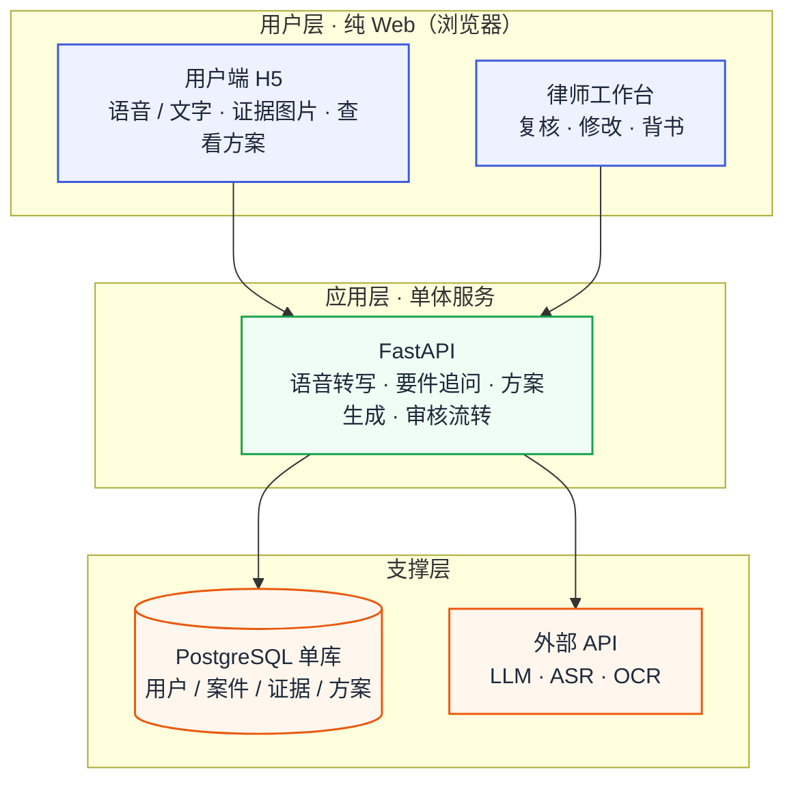
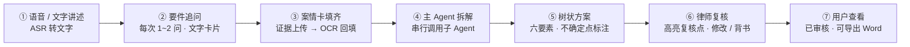
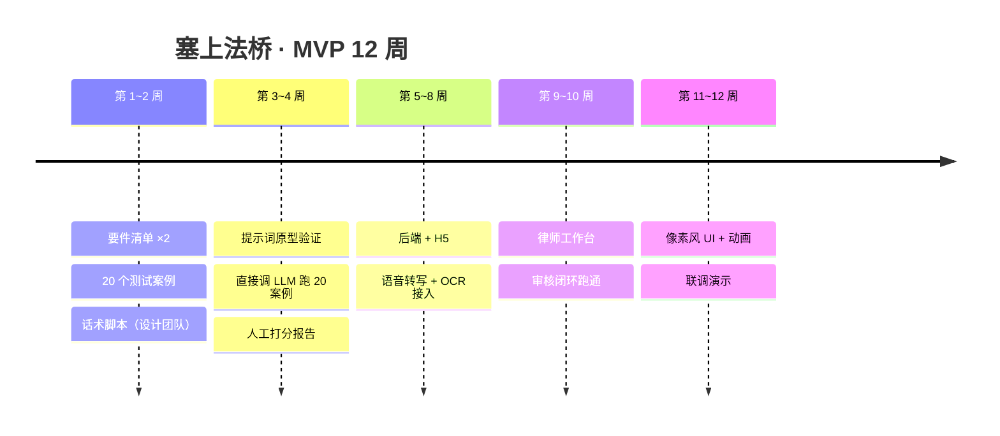

# 塞上法桥 · 可行技术方案（MVP 版 v2.0）

> **文档用途**：面向开发团队的最小可行版本实施方案。
> **一句话定位**：用现成 AI API 搭一个"语音讲案情 → AI 按要件追问 → 自动出树状方案 → 律师复核背书"的单场景闭环，先跑通、先证明价值，再谈复杂架构。
> **说明**：v1 完整愿景（上百子 Agent、Agent Builder、商业化生态等）已压缩至[第 7 节](#7-远期演进现在不做)；旧版全文保留在 git 历史中。

---

## 目录

1. [MVP 范围：做什么 / 不做什么](#0-mvp-范围做什么--不做什么)
2. [总体架构（一张图）](#1-总体架构一张图)
3. [技术选型（就这些，不引中间件）](#2-技术选型就这些不引中间件)
4. [核心流程（一次咨询怎么走完）](#3-核心流程一次咨询怎么走完)
5. [子 Agent：先做 4 个，全是提示词](#4-子-agent先做-4-个全是提示词)
6. [律师审核：人工环节](#5-律师审核人工环节)
7. [数据模型：4 张表起步](#6-数据模型4-张表起步)
8. [远期演进（现在不做）](#7-远期演进现在不做)
9. [里程碑：12 周出可演示 MVP](#8-里程碑12-周出可演示-mvp)
10. [风险与对策（Top 5）](#9-风险与对策top-5)
11. [设计团队现在开工的 3 件事](#10-设计团队现在开工的-3-件事)
- [附录 A：租房押金场景 · 要件清单示例](#附录-a租房押金场景--要件清单示例)
- [附录 B：MVP 验收指标](#附录-bmvp-验收指标)

---

## 0. MVP 范围：做什么 / 不做什么

**✅ 做（本版）**

| # | 功能 | 说明 |
|---|---|---|
| 1 | 手机 H5 | 用户语音/文字讲述纠纷 → AI 按要件清单追问 → 上传证据图片 |
| 2 | 树状可执行方案 | 每步固定六要素：动作 + 证据 + 依据（带条文原文）+ 时限 + 风险 + 备选；支持导出 Word |
| 3 | 律师复核闭环 | 网页工作台：AI 过程回放、不确定点高亮、修改留痕、署名背书 → 用户端显示"已审核" |
| 4 | 2 个场景起步 | 租房押金纠纷、劳动辞退赔偿（场景清单见附录 A） |
| 5 | 像素风虚拟律所 UI | 案件进度条 + 1~2 个彩蛋动画，增加可玩性 |

**❌ 不做（二期/三期再说）**：上百个子 Agent、Agent Builder、用户自建 Agent、并行调度/黑板/一致性校验、短信通知（交互全部走 Web 页面）、付费订阅/广告/案源佣金（MVP 后台手动发额度）、类案检索、实时语音打断、本地文件解析。

> ⚠️ 守则：需求一律按上表过滤，新想法进 backlog，不进本版。

---

## 1. 总体架构（分层，一张图）



> 箭头为请求方向；方案下发与状态回传的完整环路见[第 3 节核心流程](#3-核心流程一次咨询怎么走完)。

**核心思想：一个后端服务 + 3 个外部 API + 1 个数据库。** 没有微服务、没有消息队列、没有向量库、没有 Agent 框架。所有"智能"来自调用大模型 API，我们的工作主要是：设计追问逻辑、写提示词、做审核闭环。

---

## 2. 技术选型（就这些，不引中间件）

| 模块 | 选择 | 理由 |
|---|---|---|
| 前端 | Vue 3 + Vant（手机 H5） | 一套代码手机可用，无需上架审核 |
| 后端 | Python FastAPI 单体 | AI 生态好，一个服务跑完所有逻辑 |
| LLM | DeepSeek-V3（或 GLM-4） | 只选一家：便宜、中文强、够用 |
| 语音 | 火山引擎 / 讯飞 ASR API | 只做"语音 → 文字"，不做实时打断 |
| OCR | 火山 / 百度 OCR API | 合同、聊天记录、转账凭证提关键信息 |
| 数据库 | PostgreSQL 单库 | 4 张表，不引 Redis/消息队列 |
| 存储 | 阿里云 OSS（或 MinIO） | 存证据图片 |
| 部署 | 云服务器 + Docker Compose | 一台 4C8G 足够演示 |
| Agent 框架 | **不用框架** | 4 个子 Agent = 4 组提示词模板，代码里一个编排函数 |

> 捷径：若开发团队时间紧，第 3~4 周先用 Dify / Coze 搭原型验证提示词和交互，跑通后再决定是否自研后端。

---

## 3. 核心流程（一次咨询怎么走完）



要点：

1. **追问不自由发挥**：每个场景预置一张"要件清单卡"（见附录 A），AI 照着清单找缺口提问，每次只问 1~2 个最关键的问题。
2. **防转写错误**：关键数字（金额、日期、账号）由 AI 复述确认："您说的是押金 2000 元，对吗？"
3. **证据不打断对话**：用户随时传图，后台 OCR 完成后提示"已收到您的合同照片，正在提取关键信息"。
4. **不确定点必须标注**：AI 没把握的地方标黄，作为"待律师复核点"交给律师——不假装确定，才能建立信任。

---

## 4. 子 Agent：先做 4 个，全是提示词

MVP 不需要 Agent 框架，每个子 Agent 就是**一组提示词模板 + 一份知识片段**，由一个编排函数按顺序调用：

| 子 Agent | 干什么 | 实现方式 |
|---|---|---|
| ① 主 Agent | 读案情卡 → 决定调哪几个 → 串行调用 → 汇总成树状方案 | 1 个编排函数 + 1 组提示词 |
| ② 合同审查 Agent | 找违约点、押金/赔偿条款、管辖陷阱 | 提示词 + 民法典相关条文片段 |
| ③ 赔偿计算 Agent | 押金、经济补偿金（N/N+1/2N）、违约金算清楚 | 提示词 + 计算规则表；**金额计算以代码为准，不让 LLM 乱算** |
| ④ 程序指引 Agent | 去哪办、带什么材料、几天、时效 | 提示词 + 流程知识表（立案 / 仲裁 / 12348） |
| ⑤ 文书生成 Agent | 催告函、起诉状、仲裁申请书模板 | 提示词 + 文书模板库 |

- 每个子 Agent 输出统一格式：`结论 / 事实认定 / 法律依据（带条文原文）/ 行动步骤 / 风险 / 不确定点`。
- 主 Agent 负责拼装成树状方案（JSON），不确定点自动收集进"待律师复核点"。

```json
{
  "问题诊断": "租房押金返还纠纷：合同约定不明 + 房东扣款理由缺乏证据",
  "行动方案": {
    "第一步": {"动作": "书面催告（模板附上）", "证据": "押金转账记录", "依据": "民法典第563条", "时限": "3日内", "风险": "口头沟通难留证", "备选": "微信文字重发一遍"},
    "第二步": {"动作": "调解 / 拨打12348", "证据": "沟通记录", "依据": "…", "时限": "7日内", "风险": "…", "备选": "…"},
    "第三步": {"动作": "小额诉讼立案", "证据": "…", "依据": "…", "时限": "…", "风险": "诉讼时效3年", "备选": "…"}
  },
  "待律师复核点": ["押金性质认定存在两种观点"],
  "免责声明": "本内容为法律信息分析与行动指引参考，不构成正式法律意见"
}
```

---

## 5. 律师审核：人工环节

- **工作台（网页）**：左侧 = 案情卡 + AI 推理过程回放；右侧 = 方案。不确定点标黄，律师直接修改或一键背书。
- **留痕**：系统记录律师改了什么（diff），用户端状态变为"已审核"。
- **不做认证/分派算法**：账号由后台开通，案件人工分配（演示阶段按场景轮流即可）。
- **审核人来源**：法学院老师/研究生、合作律所青年律师——演示与内测阶段完全够用。

---

## 6. 数据模型：4 张表起步

| 表 | 关键字段 |
|---|---|
| users | id、手机号、昵称、角色（用户 / 律师 / 管理员） |
| cases | id、用户 id、场景类型、案情卡（JSON）、状态（采集中 → 生成中 → 待审核 → 已审核） |
| evidences | id、案件 id、证据类型（合同/转账/聊天记录）、图片地址、OCR 文本 |
| opinions | id、案件 id、树状方案（JSON）、待复核点、律师 id、修改记录、状态 |

---

## 7. 远期演进（现在不做）

| 方向 | 内容 | 触发条件 |
|---|---|---|
| 场景扩展 | 4 → 10 → 100 个子 Agent：提示词模板化 → 配置化 → Agent Builder | MVP 验收通过后 |
| 性能与成本 | 串行 → DAG 并行 + 黑板共享（省 token）；法条检索缓存 | 单案成本超预算时 |
| 商业化 | 次数额度 → 订阅 / 按次 / 广告 / 案源佣金 | 有真实用户后 |
| 渠道 | 全部 Web：H5 移动端 → 桌面端 Web / PWA 适配 | 有真实用户后 |
| 合规安全 | 生成式 AI 备案、数据加密、提示词注入防护、本地文件解析 | 上线公测前 |
| 可玩性 | 角色卡评价、彩蛋动画库、用户自建 Agent + 技能市场 | UI 稳定后 |

---

## 8. 里程碑：12 周出可演示 MVP



| 周 | 内容 | 交付 |
|---|---|---|
| 1~2 | 要件清单 ×2 + 20 个测试案例 + 语音话术脚本（设计团队主责） | 文档 |
| 3~4 | 提示词原型验证：直接调 LLM 跑 20 个案例，人工打分 | 通过率报告 |
| 5~8 | 后端 + H5 + 语音转写 + 证据 OCR | 可操作 demo |
| 9~10 | 律师工作台 + 审核闭环 | 端到端跑通 |
| 11~12 | 像素风 UI + 动画 + 联调 + 演示准备 | MVP v1.0 |

---

## 9. 风险与对策（Top 5）

| 风险 | 对策 |
|---|---|
| 提示词方案"看着专业、执行不可用" | 第 3~4 周先用测试集验证，不行就换提示词或换模型，不等到开发完再发现 |
| 语音转写错误导致事实采集错 | 关键数字复述确认 + 证据 OCR 交叉核对 |
| LLM 编造法条 | 提示词强制"依据必须带条文原文"，检索不到就标"待律师确认"，宁缺毋滥 |
| 律师供给不足 | 早期用法学院资源；律师只是复核背书，不是写案子，单人可审大量案件 |
| 范围蔓延 | 按第 0 节"不做清单"过滤需求，新想法进 backlog |

---

## 10. 设计团队现在开工的 3 件事

1. **两个场景的要件清单**：租房押金、劳动辞退赔偿（模板见附录 A）；
2. **20 个脱敏测试案例**：从公开案例/校园真实纠纷改编，每个案例附"标准答案要点"；
3. **语音话术脚本 + 树状方案手机端原型**（Figma），话术含：开场、追问、确认、打断处理。

---

## 附录 A：租房押金场景 · 要件清单示例

| 要件 | 为什么重要 | 追问话术示例 |
|---|---|---|
| 合同形式 | 押金性质、口头合同举证难 | "您签过租房合同吗？书面还是口头？" |
| 押金数额与支付方式 | 金额是争议标的 | "押金多少？现金还是转账？有记录吗？" |
| 退租交接情况 | 是否满足返还条件 | "退租时房东验房了吗？有交接记录吗？" |
| 扣款理由 | 扣款是否有事实依据 | "房东以什么理由扣钱？有证据吗？" |
| 沟通记录 | 催告证据，决定程序路径 | "您和房东怎么沟通的？有聊天记录吗？" |
| 房屋损害事实 | 判断扣款是否合理 | "房屋有损坏吗？谁造成的？" |

> 劳动辞退赔偿场景同理：劳动关系存续时间、工资基数、辞退理由与形式、有无书面通知、社保缴纳情况、加班证据等。

## 附录 B：MVP 验收指标

- 20 个测试案例全部产出树状方案（完整率 100%）；
- 律师"小改即过"率 ≥ 70%（律师几乎不用改，是 MVP 成功的唯一硬指标）；
- 单案成本 ≤ 1 元（token + API）；
- 用户一次咨询 ≤ 15 分钟；
- 律师复核平均耗时 ≤ 30 分钟。
